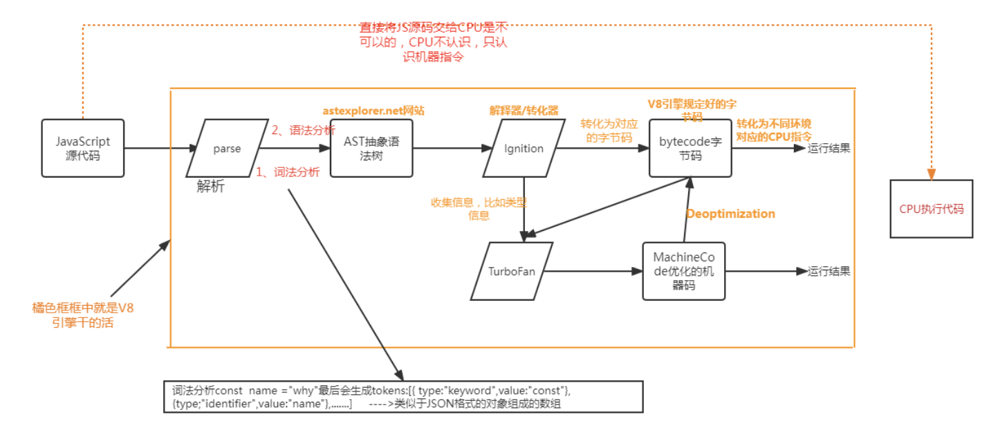
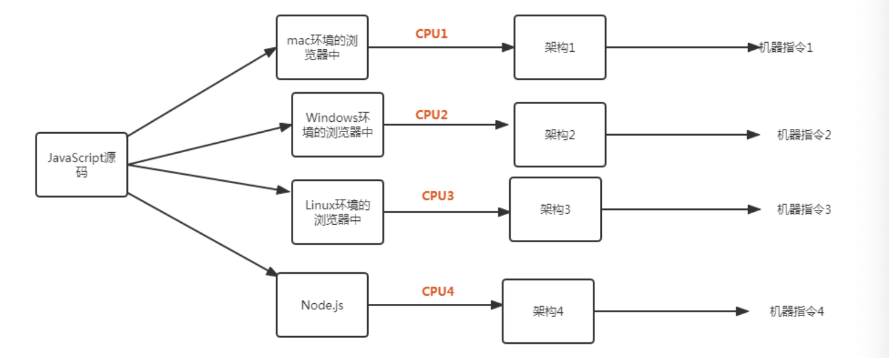
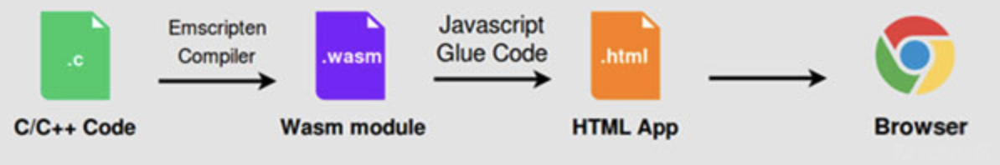

# README

## 运行方法

命令行执行`python script.py`

```
usage: script.py [-h] [-D] [-s] [-r] [-d] [-o OUTPUT_DIRECTORY] [-m MATCHER_ID] [-g TREE_GENERATOR_ID]
                 input_directory1 input_directory2 input_directory1_

命令行参数处理程序

positional arguments:
  input_directory1      输入文件目录1
  input_directory2      输入文件目录2
  input_directory1_     输入文件目录1_

options:
  -h, --help            show this help message and exit
  -D, --debugging       启用调试模式
  -s, --simple          使用简单模式
  -r, --rm_tempfile     删除临时文件
  -d, --use_docker      使用Docker
  -o OUTPUT_DIRECTORY, --output_directory OUTPUT_DIRECTORY
                        指定输出文件目录
  -m MATCHER_ID, --matcher_id MATCHER_ID
                        指定MATCHER_ID，默认为gumtree
  -g TREE_GENERATOR_ID, --tree_generator_id TREE_GENERATOR_ID
                        指定TREE_GENERATOR_ID，默认为cs-srcml
```

## 环境部署

本项目python部分使用到的库均为常用库，遇到未安装的库直接使用`pip install XXXX`即可。

下载gumtree docker镜像：`docker pull gumtreediff/gumtree`

## Javascript V8项目简介

是解析javascript语言的的虚拟机

V8引擎转换成字节码(bytecode)，此时是可以跨平台的，将字节码转化汇编指令，在不同环境的cpu下执行。





 由于公司项目的需求,现在主要是做脱Flash的工作(历史原因用AS3.0做的)!现在全部转为C++, 并且发布PC版与Web版。其中Web的版本就是使用的Wasm（WebAssembly技术）。
 WASM ，全称：WebAssembly ，是一种可以使用非 Java 编程语言编写代码并且能在浏览器上运行的技术方案，也是自 Web 诞生以来首个 Java 原生替代方案（ 程序本质上都是脚本程序，即由程序翻译指令并执行，而不是由本地机器CPU读取指令并执行，因此效率非常低。而Java的操作相对重复繁琐，在执行过程中耗时较长。）
 其实创建Wasm的初衷并非为了替代JavaScript，而是为了实现两者之间的补充和配合。随着WebAssembly的引入，现代web浏览器的虚拟机将同时运行JavaScript和Wasm代码。




## 程序与脚本

### 获取历史commit部分代码

#### git_log.py

将v8仓库中main分支的git信息读取到`GitLog-origin.txt`中

#### get_hash.py

获取所有commit的哈希值到`GitHash-origin.txt`中

#### gen_patch.py

将每一个commit的结果输出到`patches-origin`文件夹下

#### classify.py

读取`patches-origin`文件夹下的内容，自动对含有riscv关键字的文件进行分类，分离出多个架构下进行了相似改动的文件，这个检测主要依赖于文件名相似性的检测，输出到`classified_patch`中

#### split_and_filter.py 

读取`/classified_patch`中的内容，使用splitdiff，将分割并组织好的patch输出到`/tmp`

#### get_history_patch.sh

```bash
cd v8
git log > ../GitLog-origin.txt
python3 ../get_hash.py > ../GitHash-origin.txt
python3 ../gen_patch.py
rm ../GitLog-origin.txt
rm ../GitHash-origin.txt
cd ..
python3 classify.py
python3 split_and_filter.py ./classified_patch
```

运行以上代码

#### get_cfile.py

从v8项目的commit历史中获取某个commit下的文件，并拷贝到`/test`目录下的`testx.xx`

### 生成新patch部分代码

#### gumtree_parser.py

输入`gumtree diff`生成的txt文件名，将文件中的matches和diffs分别返回

#### get_ast.py

利用`gumtree parse`命令生成ast到txt文件，并返回一个经过parse的抽象语法树

#### AstDiffParser.py

处理diff操作，将原始diff进行合并处理

#### DiffParser.py

对text级别的diff文件进行parse

#### gen_result.py

将【架构1下代码，架构2下代码，架构1下修改后代码，指定架构2下修改后代码输出目录】作为参数，使用docker镜像中的gumtree textdiff命令，获取match和diff，基于ast方法生成代码文件，直接生成架构2下修改后的代码文件。

#### exec.sh

执行gen_result.py

#### show_diff.sh

在http://localhost:4567上展示两个文件的diff结果。

####  script.py

执行脚本

## 库

### V8

v8仓库 ： https://github.com/v8/v8.git

### Splitdiff

```
splitdiff -a filename
OPTIONS are:
  -a              split out every single file-level patch
  -p N            pathname components to ignore
  -d              use output filenames like a_b.c.patch for a/b.c
  -D dir          create patches in subdirectory dir (implies -d)
  -E              don't use .patch filename extension
```

### gumtree

配置教程：https://blog.csdn.net/weixin_39278265/article/details/101427644

官方文档：https://github.com/GumTreeDiff/gumtree/wiki/Commands#overriding-properties

Docker使用教程：https://github.com/GumTreeDiff/gumtree/tree/main/docker

下载镜像：`docker pull gumtreediff/gumtree`

gumtree参数：https://github.com/GumTreeDiff/gumtree/blob/089b3d5aaddb1c31385862440e889f4b90776b85/core/src/main/java/com/github/gumtreediff/matchers/ConfigurationOptions.java#L58

tree-sitter加入系统路径`export PATH="/Users/yuhaonan/Desktop/cpps/tree-sitter-parser:$PATH"`

### tree-sitter

https://blog.csdn.net/qq_38808667/article/details/128052617?spm=1001.2101.3001.6650.6&utm_medium=distribute.pc_relevant.none-task-blog-2%7Edefault%7EBlogCommendFromBaidu%7ERate-6-128052617-blog-128006684.235%5Ev38%5Epc_relevant_sort&depth_1-utm_source=distribute.pc_relevant.none-task-blog-2%7Edefault%7EBlogCommendFromBaidu%7ERate-6-128052617-blog-128006684.235%5Ev38%5Epc_relevant_sort&utm_relevant_index=12
